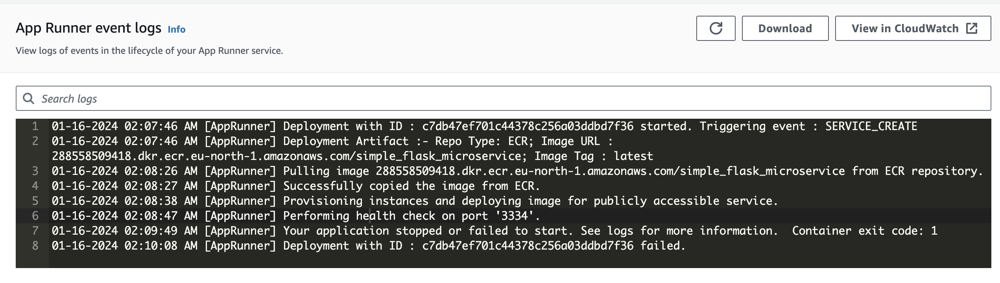

### Steps:

<!-- Aim:
Cloud Continuous Delivery of Microservice (MLOps or Data Engineering Focused)
Create a Microservice in Flask or Fast API
Push source code to Github
Configure Build System to Deploy changes
Use IaC (Infrastructure as Code) to deploy code
Use either AWS, Azure, GCP (recommended services include Google App Engine, AWS App Runner or Azure App Services)
Containerization is optional, but recommended -->

We are creating an API as a flask application accepting data from a JSON file. 

1. ```python3 -m venv venv```
2. ```source venv/bin/activate```
3. ```pip3 install flask```
4. Install python package to develop flask-based api quickly ```pip3 install flask-restx```
5. Need a database .json file for our API to interact with ```subl movies.json```
6. ```subl main.py``` and copy the following imports
```python
from flask
import Flask, Response, request, abort
// import json dependencies
from flask
import JSON, jsonify
from flask_restx
import Api, Resource, fields
```
7. Set the API entry point, load data, create data model 
8. Run the application ```python main.py```
9. Freeze requirements ```pip3 freeze > requirements.txt```

10. Dockerizing our flask app:
https://docs.docker.com/desktop/install/mac-install/

HOMEBREW_NO_AUTO_UPDATE=1 brew install --cask docker 


```subl Dockerfile``` and enter its contents..

```export PATH="$PATH:/Applications/Docker.app/Contents/Resources/bin/"```

Note: Need the desktop docker running for the next step 

```docker build --tag python-docker .```

```docker images``` #see the docker image we just created

```docker run -p 3334:3334 -d python-docker ``` #the port here should be the same as in main.py

Goto localhost:3334 or ```curl localhost:3334``` and verify!

### Extra useful docker commands:
docker ps -a #lists all running containers

docker stop <container_id>

docker rm <container_id>

11. Serving our flask app:

(Can be deployed from github, but I am doing from ECR at the moment.)

https://www.apprunnerworkshop.com/getting-started/dockerfile/ecr/

Need to push the docker image to ECR.

https://eu-north-1.console.aws.amazon.com/ecr/private-registry/repositories?region=eu-north-1

pip3 install awscli

goto https://us-east-1.console.aws.amazon.com/iam/home?region=us-east-1#/security_credentials and create access key

aws configure

aws ecr get-login-password --region eu-north-1 | docker login --username AWS --password-stdin 288558509418.dkr.ecr.eu-north-1.amazonaws.com

docker tag python-docker:latest 288558509418.dkr.ecr.eu-north-1.amazonaws.com/simple_flask_microservice:latest

docker push 288558509418.dkr.ecr.eu-north-1.amazonaws.com/simple_flask_microservice:latest


Create app runner service with "container registry", "amazon ecr", "288558509418.dkr.ecr.eu-north-1.amazonaws.com/simple_flask_microservice:latest"

Access the "Default domain" on the app runner service page and verify!

Retry this https://us-east-1.console.aws.amazon.com/apprunner/home?region=us-east-1#/services tomorrow. It's failing with 


Am I charged for aws app runner service? You are charged for the compute and memory resources used by your application. In addition, if you automate your deployments, you will pay a set monthly fee for each application that covers all automated deployments for that month. If you opt to deploy from source code, you will pay a build fee for the amount of time it takes App Runner to build a container from your source code. ... but my is free tier?.. whats free https://aws.amazon.com/free/ 

Trying again today.
Possible fixes:
1. edit and add a port env variable in service configuration and rebuild.
2. Trying to setup another app runner service, this time from the github repo .. there I can't use dockerfile, need to specify install and run commands manually in the service.

Wazza, it's up and running https://xstzzxwfa7.us-east-1.awsapprunner.com/


### Sources:
- https://www.topcoder.com/thrive/articles/build-microservice-architecture-msa-rest-api-using-the-using-flask 
- https://blog.logrocket.com/build-deploy-flask-app-using-docker/ 
- https://www.freecodecamp.org/news/how-to-dockerize-a-flask-app/ 
- https://rushabhmahale002.medium.com/deploy-flask-application-on-aws-apprunner-bfad79edc69c
- https://www.apprunnerworkshop.com/getting-started/dockerfile/ecr/
- https://k21academy.com/amazon-web-services/aws-cli/ 